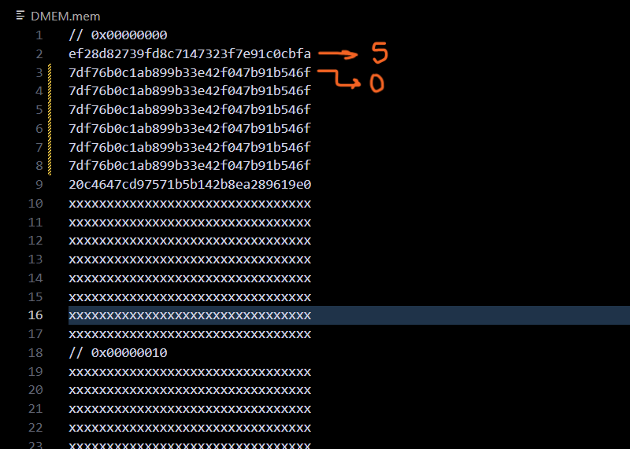
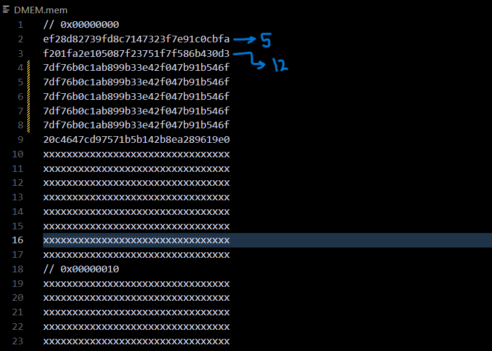

# Crypto Processor

### Description 🔍
*Crypto-Processor* is an extension to the MIPS multicycle processor that uses AES-128 to encrypt data before writing it to the data memory, and decrypt data after reading it from the data memory. *Crypto-Processor* has a 128-bit memory width, so every read operation brings 16 bytes and every write operation stores 16 bytes. However, this is transparent to the rest of the architecture, which works with 32-bit data. Encryption and decryption each takes 10 cycles to account for the 10 rounds of AES-128. The following is a simplified FSM depicting the datapath:


> To study the full FSM, take a look at `CU.v` (the control unit).

### Utilities 🔧
For ease of use, `mips_to_machine_code.py` takes a MIPS Assembly file, translates the code to machine language, and initializes the instruction memory.

```
python mips_to_machine_code.py <path to asm code> <path to IMEM.mem>
```

For instance, `simple_load_store.asm` loads word 0 of the memory, adds 7 to it, and stores it as word 4. The following picture shows the result when words 3, 2, and 1 are initialized with 0, word 0 is initialized with 5, and the next 4 words are initialized with 0. Therefore, word 4 will be assigned 12. The first 128-bit block of the data memory is 5 and the second block is 12 encrypted using AES-128.





> The main MIPS multicycle design is inspired by the multicycle design explained in the book "Digital Design and Computer Architecture" by David and Sarah Harris.